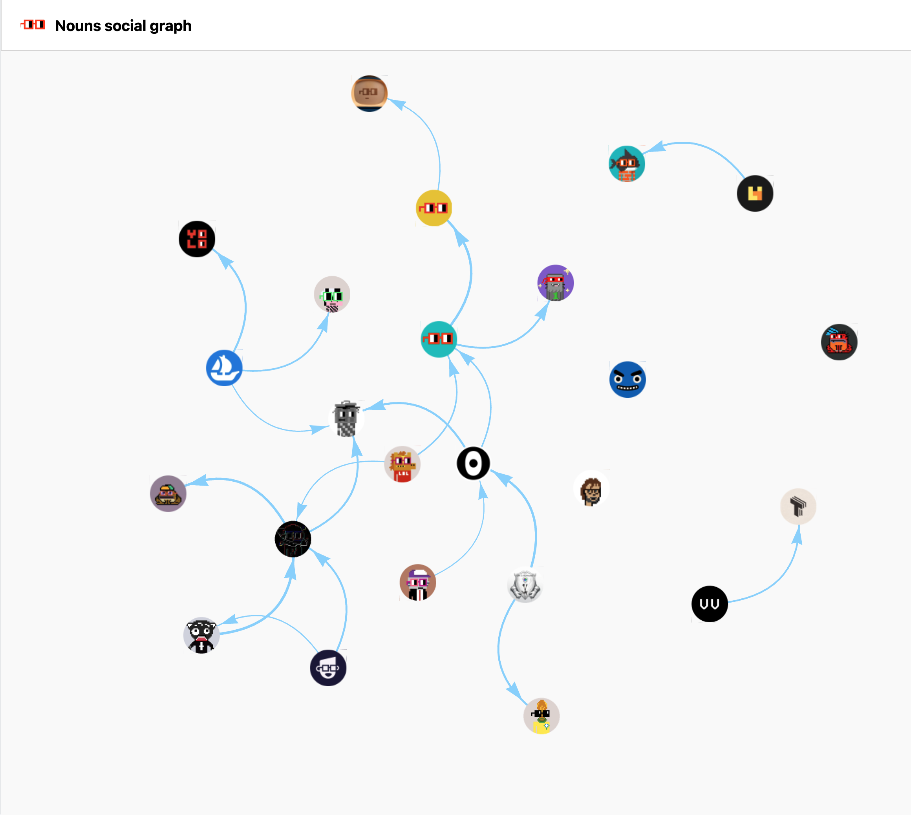
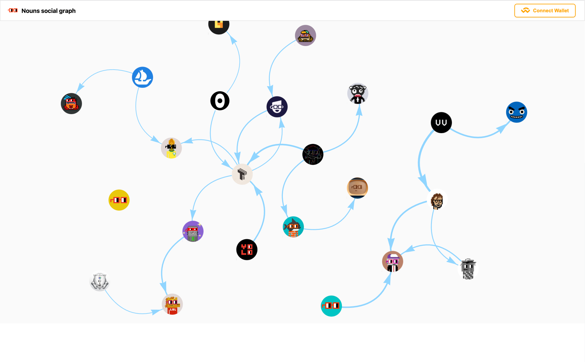
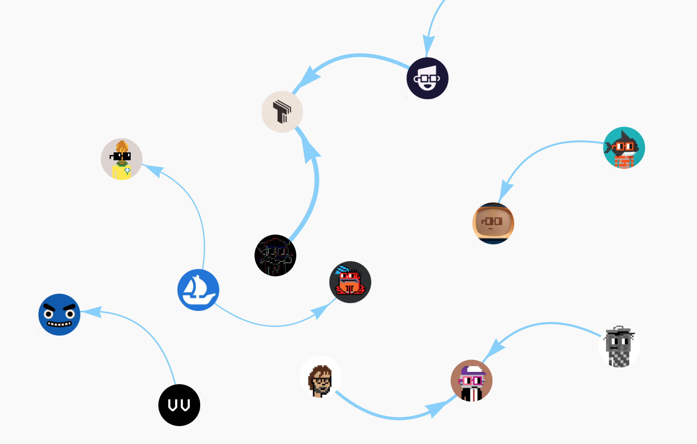
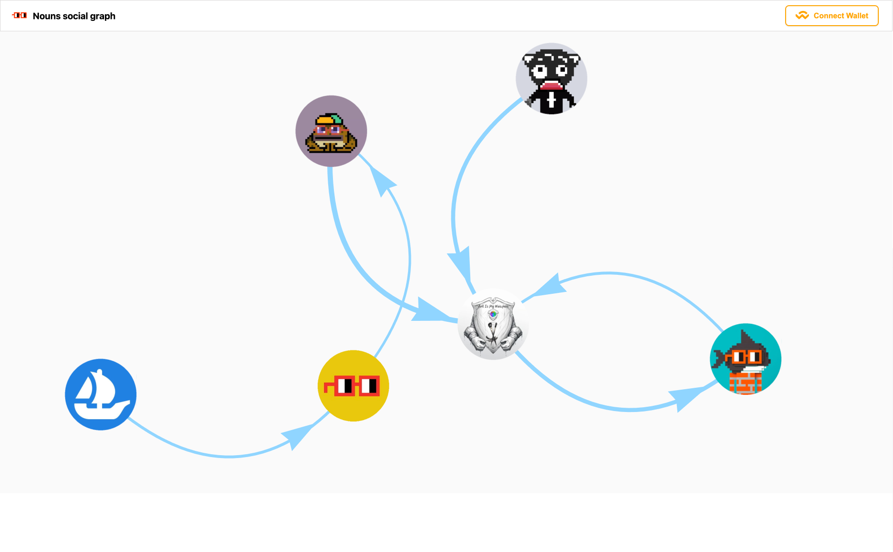

# Nouns social Graph

## The decentralized social graph for Nouns Twitter community.

I embarked on the journey to create a social graph with all Nouns Dao community members and their relationships.

This is not only fun to look through and find your place in the community.
But now you can see the impact of each member or project on a decentralized brand as a whole.
This will help to understand who is driving it forward the most!






### Technical details

I took the core members and parsed their Twitter followers/followings every day for around 2 weeks. If _N_ members have the same profile in the list we add this profile to the list and now start tracking it too.

**I use a simple greedy algorithm to determine subscribers' flow**

1. If in time _T1_ account _P_ have the follower _F_
2. And then in time _T2_ > _T1_ _F_ is subscribed to some community project/profile, we assume what the _P_ engaged this follower to the community.

This is not ideal and has some shortcomings, but generally really effective. Also, there are other techniques to resolve edge cases, but I won't bother you with them:)

### Product

The end goal is to create a web app for all DAO members to look throw and analyze the driving forces of the brand and its various social components. I believe it will be helpful to do weekly before voting for the new project to fund, so you have another factor to account for before making a decision.

For example, you can support this project with a grant as well ;)

### Data part

You can find the data-gathering and part of the analysis algorithm in the corresponding folders. Also, you need paid Twitter API to use it, so just enjoy the results:)

#### Web app part

```
npm i
```

```
npm run start
```

#### Notice

Also, the raw data and intermediate calculation are close code, case It took long time to gather them and I intend to do a community tool out of it later on.

### Challenges I ran into

- Some parts of the data gathering process could be decentralized so all members could participate

- Twitter API is very restrictive, you need several API keys to parse an account with 30k+ followers regularly, and each key costs 100$ monthly

- I used to do web scrapping but now Twitter hides the followers list and gives you only part of it

- The algo itself is not ideal, It would be better to analyze tweets but the API cost...
